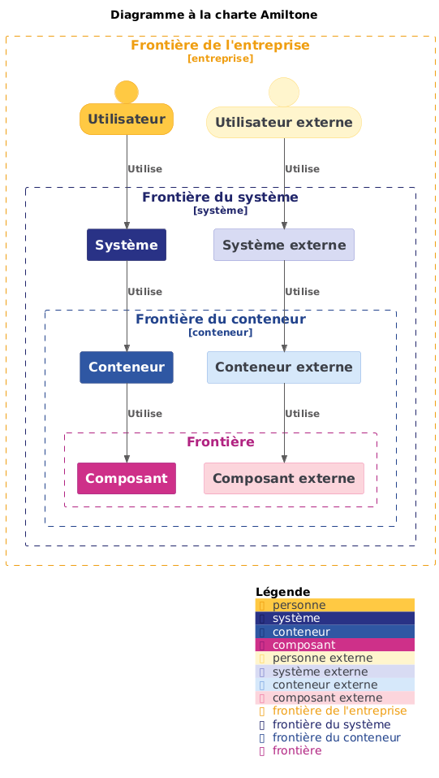

## An Amiltone brand colors palette for C4 PlantUML



### How to use this theme ?

Simply add the following line at the top of your diagram:

```puml
!theme C4_amiltone from https://raw.githubusercontent.com/Amiltone/C4-PlantUML-Themes/main/palettes
```
